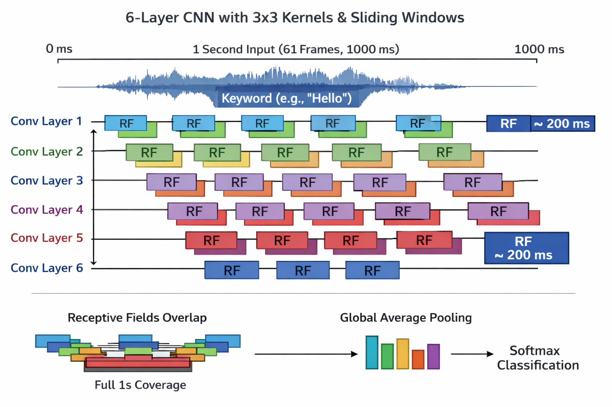
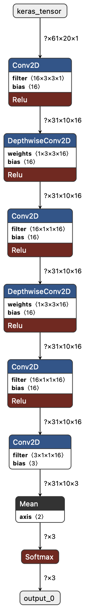

# TinyML Keyword Spotting on ARM Cortex-M

Lightweight keyword spotting (KWS) system for microcontrollers using TensorFlow Lite Micro, CMSIS-DSP, and CMSIS-NN.  
Detects a single keyword ("yes") from 1-second audio windows with low latency.

---

## Metrics & Performance Summary

| Metric | Value |
|--------|-------|
| Model type | CNN (6 Conv layers + GAP + Softmax) |
| Parameters | ~1,000 |
| Input | 61 frames × 20 log-mel coefficients (~1s audio) |
| Quantization | int8 |
| Inference time | ~60 ms on Cortex-M4F 64 MHz |
| Training accuracy | ~90%+ (3 epochs) |
| Memory footprint | Very small, fits on low-power MCUs |

---

## Highlights

- Approximately 1,000 parameter CNN  
- ~60 ms inference on Cortex-M4F @ 64 MHz  
- int8 quantized model  
- CMSIS-NN accelerated CNN  
- CMSIS-DSP accelerated feature extraction  
- Designed for low-power Cortex-M MCUs  

---

## Project Overview

Keyword spotting is a lightweight speech recognition system for detecting specific trigger words.  

This project implements single-keyword spotting using the Google Speech Commands dataset, deployed on an ARM Cortex-M4F MCU.

### Classes

- `keyword` ("yes")  
- `unknown speech`  
- `silence`  

Effectively acts as binary classification:  
`keyword vs everything else`

The keyword "YES" is chosen for its three phonemes, improving single-word detection reliability.

---

## Model Summary

| Feature | Value |
|---------|------|
| Model type | Convolutional Neural Network (CNN) |
| Parameters | ~1,000 |
| Layers | 6 convolution layers |
| Pooling | Global Average Pooling |
| Output | Softmax |
| Quantization | int8 |
| Input | Log-Mel Spectrogram |
| Framework | TensorFlow / TensorFlow Lite Micro |

---

## Input Features

### Audio Parameters

| Parameter | Value |
|-----------|------|
| Sample Rate | 16 kHz |
| Frame Size | 512 samples |
| Frame Duration | 32 ms |
| Hop Size | 256 samples |
| Hop Duration | 16 ms |
| Overlap | 50% |

### Spectrogram Dimensions

61 time frames × 20 log-mel coefficients (~1 second of audio)

---

## Model Architecture

- 3 convolutional stages: Conv2D → DepthwiseConv2D  
- Global Average Pooling  
- Softmax output

```
Input Spectrogram
    ↓
Conv2D → DepthwiseConv2D
    ↓
Conv2D → DepthwiseConv2D
    ↓
Conv2D → DepthwiseConv2D
    ↓
Global Average Pooling
    ↓
Softmax
```

Stacked layers increase the receptive field, capturing long-range phonetic patterns.



---

## Embedded Deployment

### Hardware

- ARM Cortex-M4F @ 64 MHz  
- Hardware FPU for DSP acceleration  

### Libraries

- CMSIS-DSP: FFT, vector/matrix math  
- CMSIS-NN: accelerated CNN kernels  

TensorFlow Lite Micro automatically invokes CMSIS-NN for optimal performance.

---

## Feature Extraction Pipeline

```c
arm_mult_f32(audioFrame, hannWindow, windowed, FRAME_SIZE);
arm_rfft_fast_f32(&fft_inst, windowed, fftOut, 0);

for (int i = 0; i < SPECTRUM_BINS; i++) {
    float real = fftOut[2*i];
    float imag = fftOut[2*i+1];
    mag[i] = real*real + imag*imag;
}

arm_mat_mult_f32(&melMat, &magVec, &melOut);

for (int m = 0; m < NUM_MEL; m++) {
    float log_mel = logf(melRowTmp[m] + 1e-6f);
    int32_t q = (int32_t)roundf(log_mel / input_scale + input_zero_point);
    quantized_mel_row[m] = (int8_t)constrain(q, -128, 127);
}
```

Manual power spectrum ensures consistency between training and MCU pipeline.

---

## Performance

### Training

| Metric | Value |
|--------|-------|
| Accuracy (3 epochs) | ~90%+ |
| Dataset | Google Speech Commands |

### Inference

| MCU | Inference Time | Parameters |
|-----|----------------|-----------|
| Cortex-M4F 64MHz | ~60 ms | ~1,000 |

Optimization could reduce inference to 20–30 ms.

---

## Benchmark & Comparison

| Model | Dataset | Parameters | Inference (ms) | Accuracy | MCU |
|-------|---------|-----------|----------------|---------|-----|
| TinyML KWS (this project) | Google SC | ~1,000 | 60 | ~90%+ | Cortex-M4F 64MHz |
| TFLM CNN Example | Google SC | ~8,000 | 120 | 92 | Cortex-M4F 72MHz |
| ARM CMSIS-NN Ref | Google SC | ~2,500 | 45 | 88 | Cortex-M4 80MHz |
| KeywordSpotting-Small | Google SC | ~10,000 | 150 | 95 | STM32F746 216MHz |

TinyML KWS is ultra-lightweight and maintains real-time operation.

---

## Batch vs Streaming Inference

- Batch mode: ~1 s latency  
- Streaming mode (future): 30–100 ms latency  

Circular buffers can reduce DSP overhead and improve streaming latency.

---

## Silence Handling

Limited dataset silence → weak correlation with real silence.  

Solution: augment silence data and retrain.

---

## Future Work

1. Streaming audio pipeline (circular buffers)  
2. Multi-keyword detection (5–10 keywords)  
3. TinyLLM voice interface with flexible commands:

```
Robot, get me a black coffee
Robot, I want a coffee
Robot, I'll take my coffee now
```

---

## Model Visualization

Generated using Netron:



---

## License

MIT License
